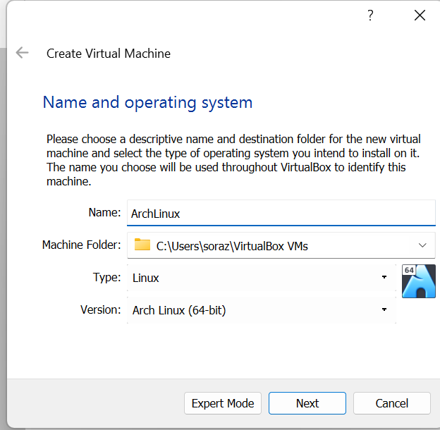
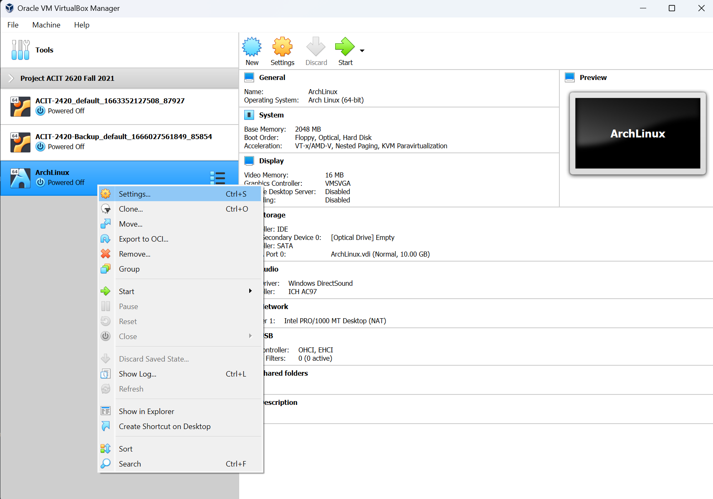
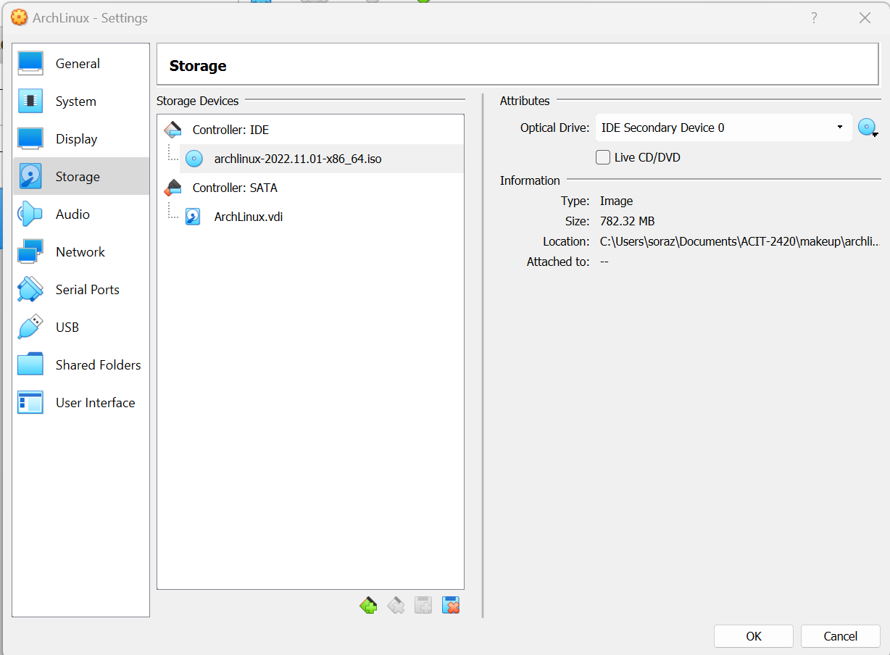

# ACIT 2420 Makeup Assignment README

Table of Contents
- [Pre-Requirements](#pre-requirements)
- [Setting Up ArchLinux in VirtualBox](#setting-up-archlinux-in-virtualbox)

## Pre-Requirements

1. You must have the ISO file pre-installed. You can visit the archlinux download page from this [Link](https://archlinux.org/download/)

2. You have VirtualBox installed.

## Setting Up ArchLinux in VirtualBox

1. On VirtualBox, create a new virtual machine with the initial configuration as follows, then click "Next".
- Name: ArchLinux
- Type: Linux
- Version: Arch Linux (64-bit) or (32-bit)

2. Set the memory size to 2048 then click "Next".

3. Select "Create a virtual hard disk now" then click "Create".

4. Select VDI (VirtualBox Disk Image) then click "Next".

5. Select "Fixed size" then click "Next".

6. Set the file size to 10GB then click "Create".

7. Once the "ArchLinux" VM is displayed on the right side of the VirtualBox application, right-click on "ArchLinux" then click "Settings"

8. Click on "System", then the  "Processor" tab and increase the number of Processor(s) to 2.

9. Click on "Storage", then double click on "Empty" under "Controller: IDE".

10. Click on the small gear icon to the right of the "Optical Drive:" dropdown menu and select "Choose a disk file...".

11. Select the ISO file and click "Open", then click "Ok" to save all changes made.

- Note: You should now see the ISO filename instead of "Empty" under "Controller: IDE"

You have successfully created the Arch Linux VM!

