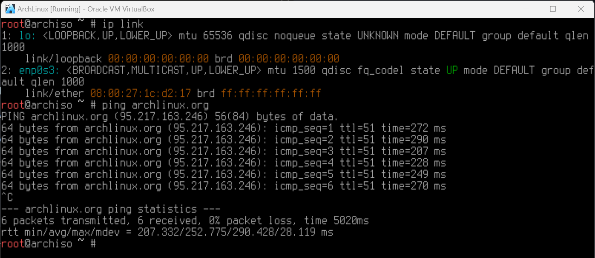
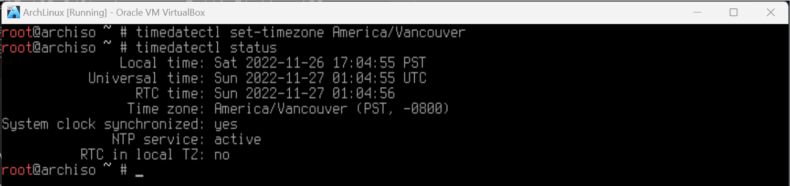
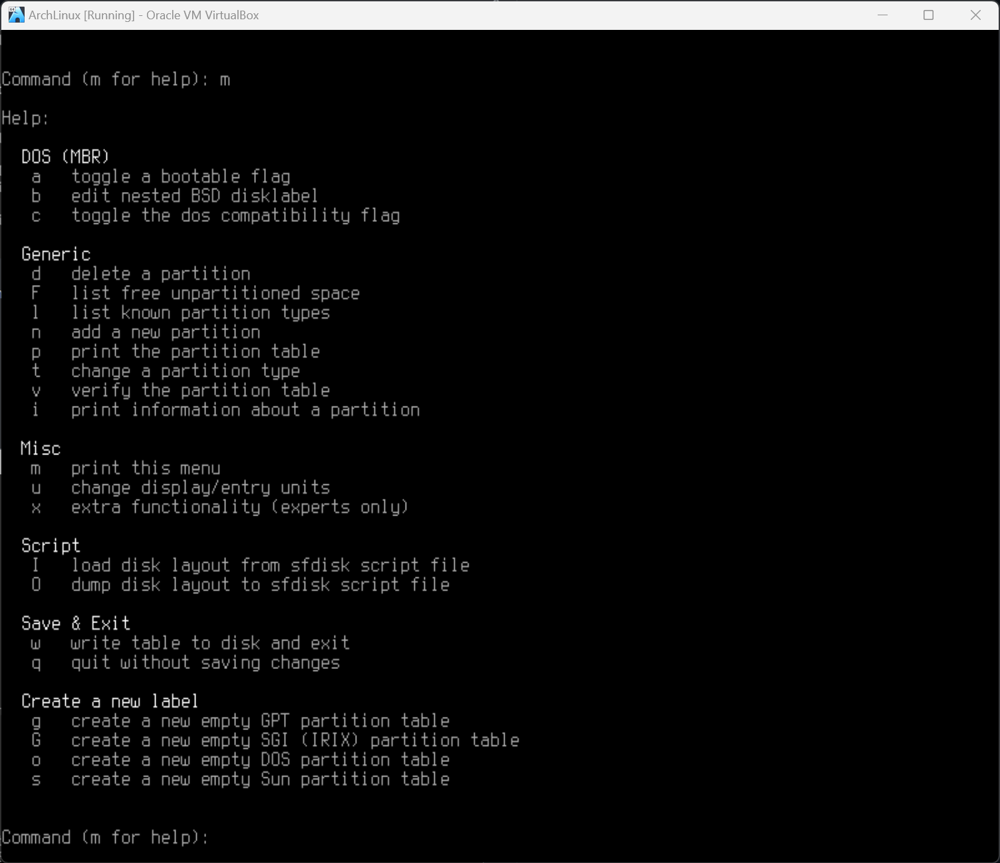
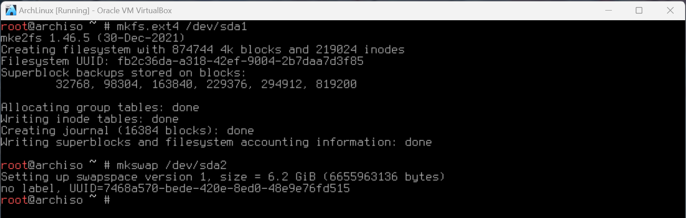
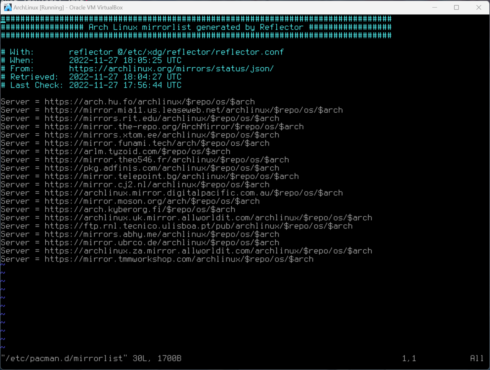
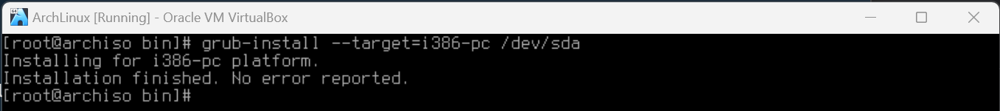

# ACIT 2420 Makeup Assignment README

Table of Contents
- [Pre-Requirements](#pre-requirements)
- [Setting Up ArchLinux in VirtualBox](#setting-up-archlinux-in-virtualbox)
- [Starting up ArchLinux from VirtualBox](#starting-up-archlinux-from-virtualbox)
- [Setting the Keyboard Layout](#setting-the-keyboard-layout)
- [Boot Mode Verification](#boot-mode-verification)
- [Connecting to The Internet](#connecting-to-the-internet)
- [Updating the System Clock](#updating-the-system-clock)
- [Partitioning the Disks](#partitioning-the-disks)
- [Partition Formatting](#partition-formatting)
- [Mounting the File System](#mounting-the-file-system)
- [Select the Installation Mirrors](#select-the-installation-mirrors)
- [Installing the Essential Packages](#installing-the-essential-packages)
- [Configure the System](#configure-the-system) 
- [Setting the Timezone](#setting-the-timezone)
- [Localization](#localization)
- [Network Configuration](#network-configuration)
- [Initramfs Configuration](#initramfs-configuration)
- [Setting the root Password](#setting-the-root-password)
- [Installing the GRUB Boot Loader](#installing-the-grub-boot-loader)
- [GRUB Configuration File](#grub-configuration-file)

## Pre-Requirements

1. You must have the ISO file pre-installed. You can visit the archlinux download page from this [Link](https://archlinux.org/download/)

2. You have VirtualBox installed.

## Setting Up ArchLinux in VirtualBox

1. On VirtualBox, create a new virtual machine with the initial configuration as follows, then click "Next".
- Name: ArchLinux
- Type: Linux
- Version: Arch Linux (64-bit) or (32-bit)


2. Set the memory size to 2048 then click "Next".

3. Select "Create a virtual hard disk now" then click "Create".

4. Select VDI (VirtualBox Disk Image) then click "Next".

5. Select "Fixed size" then click "Next".

6. Set the file size to 10GB then click "Create".

7. Once the "ArchLinux" VM is displayed on the right side of the VirtualBox application, right-click on "ArchLinux" then click "Settings"


8. Click on "System", then the  "Processor" tab and increase the number of Processor(s) to 2.

9. Click on "Storage", then double click on "Empty" under "Controller: IDE".

10. Click on the small gear icon to the right of the "Optical Drive:" dropdown menu and select "Choose a disk file...".

11. Select the ISO file and click "Open", then click "Ok" to save all changes made.

- Note: You should now see the ISO filename instead of "Empty" under "Controller: IDE"


You have successfully created the Arch Linux VM!

## Starting up ArchLinux from VirtualBox

1. Click on the ArchLinux VM that you have created in the previous step and click the "Start" button.

- Note: This will open up a new terminal where we will be interacting with ArchLinux itself.

- **Note:** It will take a little bit of time for ArchLinux to startup. Once it does, the screen should look as the image below.


## Setting the Keyboard Layout

Section 1.5 of the ArchLinux Installation Guide.

- Note: The default keyboard layout is set to English US. If this is your preferred layout, then skip this section.

1. To view the list of keyboard layouts available, use the command: `ls /usr/share/kbd/keymaps/**/*.map.gz`

2. To use a specific layout, use the command: `loadkeys *filename*`.

- Note: Only include the filename and NOT the extension, `.map.gz` from the list of layouts available.

3. (Optional) You can also set the font by using the `setfont` command.

- Note: The list of font types can be displayed by using the command: `ls /usr/share/kbd/consolefonts`

## Boot Mode Verification

1. Use the command: `ls /sys/firmware/efi/efivars` to have an understanding of which boot mode is being utilized.

- If the command does not give an error, boot mode: UEFI

- If the command does give an error, boot mode: BIOS or CSM

- Note: Refer to the motherboard manual to set the desired boot mode.


## Connecting to The Internet

1. To verify that the network interface is enabled, use the `ip link` command.

- For Ethernet: You will only have to plug in the Ethernet cable.

- For Wi-Fi: You must authenticate with the wireless network using the `iwctl` command.

- For Mobile Broadband Modem: You must connect to the mobile network with the `mmcli` command.

2. Test the connection by using the `ping` command to a destination.

	`ping archlinux.org`

- Note: A successful ping command will look similar to the image below.



## Updating the System Clock

1. Use the `timedatectl status` command to verify the current time.

- Note: The time and date should automatically be set to the correct time once a internet connection is secured.

**If the timezone is not correct**

2. Use the `timedatectl set-timezone *region*` to change the timezone.

- I have changed my timezone to America/Vancouver in the image below.



## Partitioning the Disks

1. Identify the block device by using the command: `fdisk -l`.

- Note: You can also use the `lsblk` command which is easier to read in my opinion.


2. To modify the partition tables, use the command: `fdisk /dev/*disk-to-patition*`. In my case, I will be partitioning `/dev/sda`.

- Note: If you would like to create any stacked block devices such as LVM, system encryption, or RAID, this must be done so now.

- Note: You can type `m` for the help page.



3. I will be creating a new partition, so type `n`.

4. I will be setting the partition type to extended, so type `p`.

5. I will use the default partition number (1) and the First Sector set to default (2048), so hit `Enter` twice.

4. The Last Sector will define the size of the partition, so I will set it to, 7000000, which creates about 3.3Gb of space.

- **Note:** Set the partition size according to your needs.

5. To save changes, type `w`.


6. Create another new partition with the following configurations:

	- partition type: primary
	- partition number: 2
	- First Sector: default (hit `Enter`)
	- Last Sector: The size of your choice, I used 20000000, which creates about 6.2Gb of storage

7. Enter `w` to save changes.


8. To change the partition type for `/dev/sda2` to swap, use the following commands in order:

	```
	fdisk /dev/sda

	t

	2

	82
	```

9. Enter `w` to save changes. 


- Note: You can check to see if the partition type was changed correctly by using the `fdisk -l` command.

8. Verify that the extended partition now exists by using the `fdisk -l` or `lsblk` command.

  

## Partition Formatting

1. To format the newly created partitions, use either of the following commands:

- To create an Ext4 file system, use the command: `mkfs.ext4 /dev/*device-name*`

- If you created a "swap" partition, initialize it by using the commnad: `mkswap /dev/*swap-device-name*`

- If you created an EFI system partition, you must format it to FAT32 by using the command: `mkfs.fat -F 32 /dev/*efi-system-partition*` 

- **Note:** I will be using the Ext4 file system command for /dev/sda1 and the swap command for /dev/sda2.



## Mounting the File System

1. To mount the file system we created, use the command: `mount /dev/sda1 /mnt`.

- Note: This command will not give any outputs to the terminal.

2. Create any remaining mounting points with the following commands:

- For UEFI systems: `mount --mkdir /dev/*efi-system-partition* /mnt/boot`

- For swap: `swapon /dev/*swap-partition*`

3. Verify that the mount was successful by using the command: `lsblk`.

- Note: `/mnt` has been added as the `MOUNTPOINTS` for `/dev/sda1` and `[SWAP]` has been added as the `MOUNTPOINTS` for `/dev/sda2`


## Select the Installation Mirrors

- **Important Note:** The packages that will be installed is defined in `/etc/pacman.d/mirrorlist`. This file will later be copied so you should verify that the file is correct.

1. To edit the file, use the command `vim /etc/pacman.d/mirrorlist`. The contents of the file should look similar to the image below.



- Note: The top of the package list has a higher priority, so if you wish to have one of the packages with a higher download priority, place it at the top of the list.

## Installing the Essential Packages

1. Install the base package by using the command: `pacstrap -K /mnt base linux linux-firmware`

- Note: The base package does not include all tools from the live installation. You may want to consider the following packages:

  - userspace utilities: management of the file systems
  - other utilities: accessing RAID or LVM partitions
  - specific firmware for other devices that is not included in the linux-firmware already being installed
  - networking softwares
  - text editor

- Note: To view the list of packages available, visit this [Link](https://archlinux.org/packages/?name=man-pages)

The download should begin and the download progress should be similar to the image below.


**Trouble Shooting**

If you get the error message, `failed to synchronize all databases` try running the following commands in order:

	```
	pacman -Syy

	pacman -S reflector
	```

or try running the command, `pacman -Syu` instead.

When successful, the output should look similar to the image below.


## Configure the System

1. Generate a fstab file by using the command: `genfstab -U /mnt >> /mnt/etc/fstab`.

2. Verify that the file you have just created by running the command: `vim /mnt/etc/fstab`.

- Note: You should also edit any errors you notice in the file. The file generated should look similar to the image below.


## Change root

1. Change the apparent root directory by running the command: `arch-chroot /mnt`.

If everything was setup correctly, the terminal is going to slightly change like the image below.


## Setting the Timezone

1. Set the timezone by running the command: `ln -sf /usr/share/zoneinfo/America/Vancouver /etc/localtime`.

2. To generate the hardware clock time, use the command: `hwclock --systohc`.

- Note: The timezone by default is UTC.

## Localization

1. Uncomment the following contents in the file `/etc/locale.gen`.

- Note: I am using the `vim` tool which is not installed by default. To install it, use the command: `pacstrap -K /mnt vim` in the previous Linux environment.


2. Generate the locales by running the command: `locale-gen`.

If successful, you should get a similar output to the image below.


3. Create the file `/etc/locale.conf` by using the command: `vim /etc/locale.conf`.

4. In the file, add `LANG=en_US.UTF-8` then save the file.

5. (Optional) If you require a different keyboard layout, add the keyboard layout to the file `/etc/vconsole.conf`.

Example: Adding the German keyboard layout.

Contents of the `/etc/vconsole.conf` file:

	```
	KEYMAP=de-latin1
	```

## Network Configuration

1. Create the `/etc/hostname` file and add the hostname you would like to set it to.

- Note: Only the name you would like to set it to should be included in the file.

Example: I will set mine to "admin"


2. Setup the network configuration. You must install the required network manager package in the previous Linux environment.

- Note: Mine is already setup. If you have also setting this up through VirtualBox, this is done as well.

3. Verify that the network is functioning by using the following command: `ping archlinux.org`

If successful, the output should look similar to the image below.


---

## Initramfs Configuration

- **Note:** This step is usually not required, but for LVM, system encryption, or RAID you may want to consider the following steps.

1. Edit the `mkinitcpio.conf` file.

- Note: More info on `mkinitcpio.conf` can be found from this [Link](https://man.archlinux.org/man/mkinitcpio.conf.5)

2. Recreate the initramfs image by using the command: `mkinitcpio -P`

---

## Setting the root Password

1. Use the command, `passwd` to set the password for the root user. The output should be similar to the image below.


---

## Installing the GRUB Boot Loader

1. Check which partition table you are currently using by using the `gdisk -l /dev/sda` command.

- Note: The gdisk command is not installed by default, so you will need to download it using the `pacman -S gptfdisk` command.


- Note: After running the command, the output shows that I am currently using the MBR partition table.

2. Complete the specific instructions before proceeding with the following instructions from this [Link](https://wiki.archlinux.org/title/GRUB).

- For GPT, follow the GUID Partition Table (GPT) specific instructions in the link.

- For MBR, follow the Master Boot Record (MBR) specific instructions in the link.

3. Install the grub package by using the `pacman -S grub` command. The output should look similar to the image below.


4. Then install grub on the specific device name using the `grub-install --target=i386-pc /dev/sda` command.

If the installation was successful, the output should be similar to the image below.



## GRUB Configuration File

1. Generate the grub config file by using the `grub-mkconfig -o /boot/grub/grub.cfg` command.

If successful, the command output should be similar to the image below.


## Reboot

1. Exit out of the current Linux environment by using the `exit` command.

- You should notice that the command prompt reverts back to the original environment we were in.

2. (Optional) Unmount all partitions by using the `unmount -R /mnt` command.

3. Restart the machine by using the `reboot` command.

- Note: Any partitions still mounted will automatically be unmounted.

## Booting into ArchLinux

1. When prompted to select the boot disk, select the "Boot existing OS" option.


2. Select the "Arch Linux" option.


3. Once the booting process is complete, login to the root user. The password is the same password from when we created the password previously.

4. If the lgin was successful, interface will look similar to the image below.


Congratulations! You have successfully completed installing ArchLinux.

## Post-Installation

There is a list of general recommendations you should follow after completing the installation. You can view the list by following this [Link](https://wiki.archlinux.org/title/General_recommendations).

There is also a list of applications you may be interested in. More details can be found from this [Link](https://wiki.archlinux.org/title/List_of_applications).


